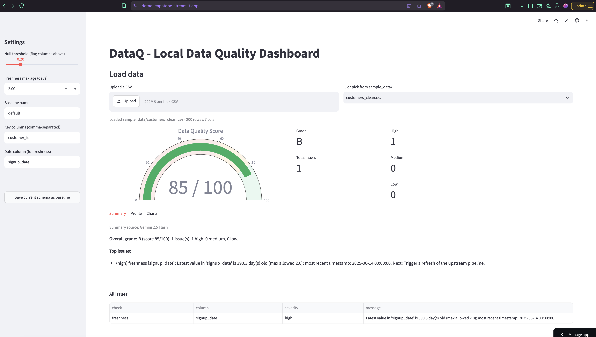

# DataQ

A local data-quality dashboard built with **pandas** and **Streamlit**.
Runs entirely on your machine - no hosting required.



> _Screenshot placeholder - drop a PNG at `docs/screenshot.png` after the first run._

## Features

- **Profiling** - per-column dtype, null counts, distinct counts, and numeric
  min/max/mean via `profile_dataframe`.
- **Quality checks** - nulls above a threshold, fully duplicated rows,
  key-column uniqueness, and out-of-range numeric values.
- **Schema drift** - persist a `{column: dtype}` baseline as JSON and detect
  added, removed, or type-changed columns.
- **Freshness** - flag stale data based on the newest value of a timestamp
  column and a configurable max age (days).
- **Scoring** - weighted 0-100 score with an A-F letter grade and
  per-severity counts.
- **Summaries** - concise plain-English summary (rule-based by default;
  optional Gemini 2.5 Flash summary when `GEMINI_API_KEY` is set).
- **Streamlit UI** - Plotly gauge, tabbed layout (Summary / Profile /
  Charts), CSV upload or `sample_data/` picker, and a sidebar
  "Save current schema as baseline" button.

## Project structure

```
DataQ/
├── app.py                # Streamlit entry point
├── checks/
│   ├── profiling.py
│   ├── quality.py
│   ├── schema.py
│   └── freshness.py
├── scoring.py
├── summarize.py
├── make_sample_data.py   # Generates sample CSVs
├── sample_data/          # Example input datasets
├── baselines/            # Stored schema baselines (JSON)
├── tests/                # Pytest suite
├── requirements.txt
└── README.md
```

## Setup

```bash
python -m venv .venv
source .venv/bin/activate
pip install -r requirements.txt
```

(Optional) generate the bundled sample datasets:

```bash
python make_sample_data.py
```

(Optional) enable the Gemini-powered summary:

```bash
export GEMINI_API_KEY=your-key-here
```

## Run

```bash
streamlit run app.py
```

Then open the URL Streamlit prints (usually <http://localhost:8501>).
Upload a CSV or pick a file from `sample_data/` to begin.

## Tests

```bash
pip install pytest
pytest
```
